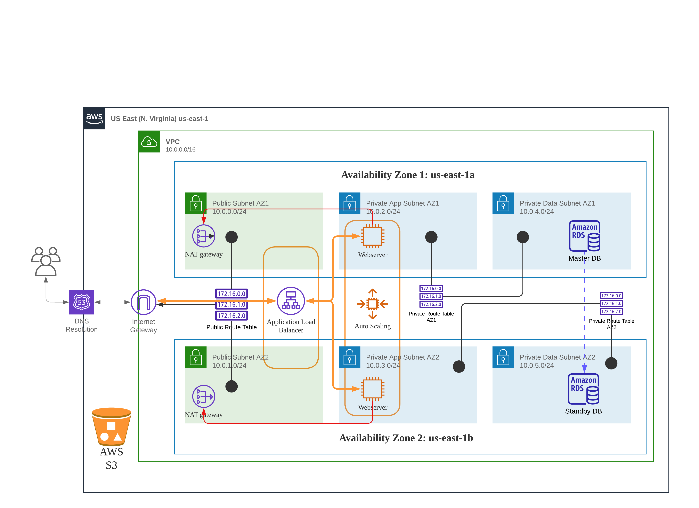

# AWS - Host dynamic website using three-tier architecture

## Overview
We are developing a robust and resilient E-commerce application in the us-east-1 region of AWS, leveraging two availability zones: us-east-1a and us-east-1b. The architecture comprises the following components and services to ensure high availability and fault tolerance:



## Prerequisites
Have basic AWS knowledge

## Steps

### 1- Create a VPC
To create a VPC with proper DNS configuration, it's crucial to enable DNS resolution and DNS hostnames. DNS resolution allows your VPC resources to resolve domain names to IP addresses, facilitating communication with other resources within the VPC and beyond. On the other hand, enabling DNS hostnames allows your resources to have meaningful and memorable domain names, making them easily accessible.

Here's how you can ensure that DNS resolution and DNS hostnames are enabled when creating your VPC:

1) Navigate to the AWS Management Console and open the Amazon VPC service.
2) Click on "Your VPCs" in the navigation pane, then select "Create VPC".
3) Provide a name and specify the desired IPv4 CIDR block for your VPC. You can also choose to enable IPv6 CIDR block if required.
4) Under the "DNS resolution" section, make sure to select the option to "Enable DNS resolution". This setting allows your VPC to resolve domain names.
5) In the "DNS hostnames" section, select the option to "Enable DNS hostnames". Enabling this option will provide your resources with meaningful domain names.
6) Finally, click on "Create VPC" to create your VPC with the specified DNS settings.

### 2- Create an Internet Gateway
To establish internet connectivity within your AWS VPC, you need to create an Internet Gateway (IGW) and attach it to your VPC. An IGW acts as a bridge between your VPC and the internet, enabling inbound and outbound traffic. Here's how you can create and attach an Internet Gateway to your VPC:

1) Open the AWS Management Console and navigate to the Amazon VPC service.
2) Click on "Internet Gateways" in the navigation pane and select "Create Internet Gateway".
3) Provide a name for your Internet Gateway and click on "Create". The IGW will be created and listed in the Internet Gateways section.
4) Next, select the newly created Internet Gateway from the list and choose "Actions" > "Attach to VPC".
5) In the "Attach to VPC" dialog box, select your desired VPC from the drop-down menu and click on "Attach".
Once attached, the Internet Gateway becomes the entry and exit point for internet traffic in your VPC.

### 3- Create Public Subnets
To design a well-structured AWS VPC, it's essential to create public subnets across multiple Availability Zones. Distributing your resources across AZs enhances fault tolerance and ensures high availability. Let's dive into the step-by-step process of creating public subnets in two Availability Zones:

Note) Before proceeding, use the CIDR.xyz website (https://cidr.xyz/) to visualize and plan your network architecture. This tool enables you to easily determine the appropriate CIDR block for your VPC and subnets, ensuring efficient IP address allocation.
1) Open the AWS Management Console and navigate to the Amazon VPC service.
2) Click on "Subnets" in the navigation pane and select "Create subnet".
3) In the "Create subnet" wizard, choose the VPC where you want to create the subnets.
4) Select <b>us-east-1a</b> Availability Zone from the drop-down menu
5) Enter the name <b>Public Subnet AZ1</b> for the subnet and specify the desired IPv4 CIDR block <b>10.0.0.0/24</b>
6) Ensure that the "Auto-assign public IPv4 address" option is enabled in the subnet. This allows instances launched within the subnet to have public IP addresses.
7) Click on "Create subnet" to create the public subnets across the selected AZs.
8) Repeat the same steps for create a new subnet in <b>us-east-1b</b> Availability Zone with CIDR of <b>10.0.1.0/24</b>

### 4- Create a public route table
To enable seamless communication to and from your public subnets within your AWS VPC, it's important to configure a dedicated public route table. This route table will define the paths for traffic to reach the internet and other resources within your VPC. Let's walk through the steps of creating a public route table and assigning it to the existing public subnets:

1) Open the AWS Management Console and navigate to the Amazon VPC service.
2) Click on "Route Tables" in the navigation pane and select "Create route table".
3) Choose the VPC you created earlier as the association for the route table.
4) Provide a name for the route table, <b>Public Route Table</b>, to distinguish it from other route tables within your VPC.
5) Click on "Create" to create the public route table.
6) With the public route table created, select it from the list and choose the "Routes" tab.
7) Click on "Edit routes" and add a new route by specifying the destination as "0.0.0.0/0" to represent all internet traffic.
8) Set the target of the route as the Internet Gateway that you previously attached to your VPC. This directs internet-bound traffic to the gateway.
9) Save the changes to update the routes in the public route table.

### 5- Associate the Public Route Table with the Public Subnets
Now, it's time to associate the public route table with the previously created public subnets: 
1) Select the route table and choose the "Subnet associations" tab.
2) Click on "Edit subnet associations" and select the public subnets you created earlier.
3) Save the changes to associate the public route table with the public subnets.

### 6- Create the Application Layer subnets
To establish a secure and well-structured AWS VPC, it is crucial to create private subnets for your application and data layers. By separating these layers into different subnets, you can control access and implement stricter security measures.

Let's explore the step-by-step process of creating four private subnets, with two in each Availability Zone:
1) Open the AWS Management Console and navigate to the Amazon VPC service.
2) Click on "Subnets" in the navigation pane and select "Create subnet".
3) Choose the VPC where you want to create the subnets.
4) Select <b>us-east-1a</b> Availability Zone from the drop-down menu and set the CIDR to <b>10.0.2.0/24</b>.
5) Enter a name for the subnet, <b>Private App Subnet AZ1</b>
6) Repeat steps to create the second subnet for the application layer in the <b>us-east-1b</b> AZ, with name <b>Private App Subnet AZ2</b> and CIDR <b>10.0.3.0/24</b>.

### 7- Create the Data Layer subnets
1) Open the AWS Management Console and navigate to the Amazon VPC service.
2) Click on "Subnets" in the navigation pane and select "Create subnet".
3) Choose the VPC where you want to create the subnets.
4) Select <b>us-east-1a</b> Availability Zone from the drop-down menu and set the CIDR to <b>10.0.4.0/24</b>.
5) Enter a name for the subnet, <b>Private Data Subnet AZ1</b>
6) Repeat steps to create the second subnet for the application layer in the <b>us-east-1b</b> AZ, with name <b>Private Data Subnet AZ2</b> and CIDR <b>10.0.5.0/24</b>.

### 8- Create NAT Gateways in public subnets
To provide internet access to resources within private subnets of your AWS VPC, you need to create NAT gateways in the public subnets of each Availability Zone (AZ). NAT gateways act as a bridge between your private subnets and the internet, allowing outbound traffic from your private subnets to reach the internet. Let's explore the step-by-step process of creating NAT gateways in the <b>Public Subnet AZ1</b> and <b>Public Subnet AZ2</b>:

1) Open the AWS Management Console and navigate to the Amazon VPC service.
2) Click on "NAT Gateways" in the navigation pane and select "Create NAT Gateway".
3) Choose <b>Public Subnet AZ1</b> from the drop-down menu. This subnet should be one of the public subnets you created earlier.
4) Select the Elastic IP (EIP) allocation method. You can choose to either use an existing EIP or create a new one.
5) Click on "Create NAT Gateway" to initiate the creation process.
6) Repeat the same steps for <b>Public Subnet AZ2</b>.

### 9- Create route tables for the private subnets
To facilitate internal communication within your AWS VPC, it is essential to configure dedicated route tables for the private subnets in each Availability Zone (AZ). These route tables will define the paths for internal traffic, allowing resources in the private subnets to communicate with each other. Let's explore the step-by-step process of creating route tables for the private subnets in AZ1 and AZ2:

1) Open the AWS Management Console and navigate to the Amazon VPC service.
2) Click on "Route Tables" in the navigation pane and select "Create route table".
3) Choose the VPC where you want to create the route table.
4) Provide a name for the route table, <b>Private Route Table AZ1</b>, to indicate the associated AZ.
5) Click on "Create" to create the route table.
6) With the route table created, select it from the list and choose the "Subnet associations" tab.
7) Click on "Edit subnet associations" and select the <b>Private App Subnet AZ1</b> and <b>Private Data Subnet AZ1</b>
8) Save the changes to associate the route table with the private subnets in AZ1.
9) Then add route for destination <b>0.0.0.0/0</b> to target the NAT Gateway
10) Repeat the steps for private subnets in AZ2 (refer to the architecture graph attached at the beginning of the article)

### 10- Create the security groups
Properly configuring security groups is crucial to maintain the security and integrity of your AWS VPC. In this section, I will guide you through the steps to create and configure security groups for various components within your infrastructure.

1) Creating an ALB Security Group:
    - Open the AWS Management Console and navigate to the Amazon EC2 service.
    - Click on "Security Groups" in the navigation pane and select "Create Security Group".
    - Provide a name for the security group, such as "ALBSecurityGroup".
    - Add inbound rules to allow HTTP (port 80) and HTTPS (port 443) traffic from anywhere (0.0.0.0/0) for the ALB.
    - Save the changes to create the ALB security group.
2) Creating an SSH Security Group:
    - Follow the same steps as above to create a new security group named "SSHSecurityGroup".
    - Add an inbound rule to allow SSH (port 22) traffic from your computer IP address by specifying your IP address.
    - Save the changes to create the SSH security group.
3) Creating a Web Server Security Group:
    - Repeat the steps to create another security group named "WebServerSecurityGroup".
    - Add inbound rules to allow HTTP (port 80) and HTTPS (port 443) traffic from the ALB security group.
    - Add an inbound rule to allow SSH (port 22) traffic from the SSH security group.
    - Save the changes to create the web server security group.
4) Creating a Database Security Group:
    - Create a security group named "DatabaseSecurityGroup" following the same steps.
    - Add an inbound rule to allow MySQL/Aurora (port 3306) traffic from the web server security group.
    - Save the changes to create the database security group.

### 11- Create the RDS Database
To ensure secure and efficient database operations within your AWS VPC, it is important to create a DB Subnet Group and deploy an RDS instance in the private data subnets. This setup allows for controlled access and enhanced security for your database resources. Let's explore the step-by-step process:

1) Creating a DB Subnet Group
    - Open the AWS Management Console and navigate to the Amazon RDS service.
    - Click on "Subnet Groups" in the navigation pane and select "Create DB Subnet Group".
    - Provide a name for the DB Subnet Group, such as "PrivateDBSubnetGroup".
    - Select the VPC where you want to deploy the RDS instance.
    - Choose the private data subnets created earlier and add them to the DB Subnet Group.
    - Save the changes to create the DB Subnet Group.

2) Deploying the RDS Instance
    - In the Amazon RDS console, click on "Databases" in the navigation pane and select "Create database".
    - Choose the desired database engine, in our case it's MySQL.
    - Specify the necessary configuration details, including the DB instance class, storage, and database name.
    - Select the previously created DB Subnet Group from the dropdown menu.
    - Configure the remaining settings, such as database credentials and maintenance options, as per your requirements.
    - Ensure that the "Multi-AZ deployment" feature is disabled since it is not available under the free tier.
    - Review the configuration and click on "Create database" to deploy the RDS instance.

### 12- Create an S3 bucket to host the web files
To efficiently host web files and static content, Amazon S3 offers a cost-effective and scalable solution. Let's explore the step-by-step process of creating an S3 bucket specifically designed for hosting web files:

1) Open the AWS Management Console and navigate to the Amazon S3 service.
2) Click on "Create bucket" to start the bucket creation process.
3) Provide a unique name for your bucket, keeping in mind that bucket names must be globally unique across all of AWS.
4) Select the region where you want to create the bucket. In our case it's <b>us-east-1</b>
5) Click on "Create bucket" to create your S3 bucket.
6) Upload the [FleetCart.zip](FleetCart.zip) file to the S3 bucket.

### 13- Create an S3 bucket to host the dummy data
Repeat the steps before and Upload the [dummy.zip](dummy.zip) file to the S3 bucket.

### 14- Create a role with "AmazonS3FullAccess" policy
To enable EC2 instances to download web files from an S3 bucket, we need to create an IAM role with the appropriate permissions. Let's walk through the step-by-step process:

1) Open the AWS Management Console and navigate to the IAM service.
2) Click on "Roles" in the navigation pane and select "Create role" to begin creating a new IAM role.
3) Choose the service that will use this role. In this case, select "EC2" as the service.
4) Under "Select your use case" select the use case that best matches your requirements. For this scenario, "EC2" should be selected.
5) On the "Permissions" page, search for and select the policy named "AmazonS3FullAccess". This policy provides full access to Amazon S3 resources.
6) Click on "Next: Tags" to add any tags you want to associate with the IAM role. Tags are optional and can be used for identification and organization purposes.
7)Click on "Next: Review" to review the role configuration.
8) Provide a name for the IAM role, such as "EC2S3AccessRole" and add an optional description.
9) Review the role details to ensure they match your requirements, and click on "Create role" to create the IAM role.

### 15- Create a Web Server EC2 instance
Launching an EC2 instance as a web server involves configuring the instance, attaching security groups, and associating an IAM role. Let's proceed with the step-by-step process:

1) Open the AWS Management Console and navigate to the Amazon EC2 service.
2) Click on "Launch Instance" to begin creating a new EC2 instance.
3) Select the appropriate Amazon Linux 2 AMI as the base for your instance.
4) Choose the desired instance type, storage, and other configuration details based on your requirements.
5) In the "Configure Instance Details" section:
Select the <b>Public Subnet AZ1</b> for the instance.
6) Enable "Auto-assign Public IP" to ensure the instance has a public IP address for internet access.
7) In the "Add Tags" section, add any tags you want to associate with the EC2 instance for identification and organization purposes.
8) In the "Configure Security Group" section:
    - Select the existing SSH security group to allow SSH access to the instance.
    - Add the ALB security group to enable communication with the Application Load Balancer.
    - Include the Web Server security group to allow HTTP and HTTPS traffic to the EC2 instance.
9) In the "Configure Instance Details" section:
Select the previously created IAM role from the "IAM role" dropdown menu to grant S3 access to the instance.
10) Review the configuration details and click on "Launch" to initiate the instance launch process.

In the "Select an existing key pair or create a new key pair" dialog, choose an existing key pair or create a new one. This allows you to securely access the EC2 instance via SSH.

Click on "Launch Instances" to launch the EC2 instance.
The EC2 instance is now being launched. Once the instance is running, you can access it using SSH and configure the necessary web server software and applications.

### 16- Setup the EC2 environment
Refer to [bootstrap.txt](bootstrap.txt) to install all the dependencies needed

### 17- Import a Local Database File into RDS
To import a local database file into an Amazon RDS instance, we'll utilize MySQL Workbench and a bastion host for secure access. Let's proceed with the step-by-step process:

1) Download and Install MySQL Workbench:
    - Download MySQL Workbench from the official website and install it on your local machine.
    - Launch MySQL Workbench once the installation is complete.
2) Create a Bastion Host (EC2 Instance):
    - Open the AWS Management Console and navigate to the Amazon EC2 service.
    - Click on "Launch Instance" to create a new EC2 instance.
    - Select a suitable Amazon Machine Image (AMI) and configure the instance as a bastion host.
    - Choose or create a new key pair for secure SSH access to the bastion host.
    - Configure the security group to allow SSH access from your IP address.
    - Launch the instance and make note of its public IP address.
3) Create a Security Group for Bastion Host to RDS Access:
    - Create a new security group that allows inbound SSH access from the bastion host's private IP address.
    - Add an inbound rule for custom TCP traffic on port 3306, with the source set as the private IP address of the bastion host.
4) Attach the Security Group to the RDS Instance:
    - Go to the Amazon RDS service in the AWS Management Console.
    - Select your RDS instance and click on "Modify" to update its configuration.
    - Attach the newly created security group to the RDS instance to allow access from the bastion host.
5) Import the SQL File into the RDS Instance:
    - Launch MySQL Workbench on your local machine.
    - Configure a new connection to the RDS instance using TCP/IP over SSH.
    - Provide the necessary connection details, including the RDS endpoint, SSH host (bastion host public IP), SSH username, and SSH private key (bastion host key pair).
    - Once connected, go to the "Administrator" tab and select "Data Import/Restore".
    - Choose the "Import from Self-Contained File" option and select the [fleetcart.sql](fleetcart.sql) file.
    - Specify the target schema and execute the import process.
    - Once the import is complete, verify the data in the RDS instance.
6) Cleanup Unused Resources:
Delete the unnecessary resources, including the dummy security group, bastion host EC2 instance, and associated key pairs, to avoid incurring additional costs.

### 18- Add the dummy data to the website
To do so, follow the below:
```console
$ sudo su
$ sudo aws s3 sync s3://aosnotes77-fleetcart-dummy-data /home/ec2-user
$ sudo unzip dummy.zip
$ sudo mv dummy/* /var/www/html/public
$ sudo mv -f dummy/.DS_Store /var/www/html/public
$ sudo rm -rf /var/www/html/storage/framework/cache/data/cache
$ sudo rm -rf dummy dummy.zip
$ chown apache:apache -R /var/www/html
$ sudo service httpd restart
```

### 19- Create an Amazon Machine Image (AMI) from a Web Server EC2 Instance
To create an Amazon Machine Image (AMI) from your web server EC2 instance, we'll utilize the AWS Management Console. Let's proceed with the step-by-step process:

1) Open the AWS Management Console and navigate to the Amazon EC2 service.
2) In the EC2 Dashboard, select the web server EC2 instance from which you want to create an AMI.
3) Right-click on the selected instance and choose "Create Image (AMI)" from the context menu.
4) In the "Create Image" dialog box, provide a name and description for your AMI. This will help identify it in the future.
5) Review the instance details and ensure they are correct. You can choose to include attached EBS volumes and enable/disable the "No Reboot" option based on your requirements.
6) Click on "Create Image" to initiate the AMI creation process.


The AMI creation process will start, and you can monitor the progress on the "AMIs" page in the EC2 service.
Once the AMI creation is complete, the new AMI will be available in the "AMIs" section of the EC2 service. It will include a snapshot of the root volume and any additional attached volumes.

### 20- Setting Up an Application Load Balancer (ALB) for Web Servers
To implement an ALB for distributing incoming traffic to web servers, we'll create the necessary resources and configure them appropriately. Let's proceed with the step-by-step process:

1) Create Web Servers in the Application Subnets:
    - Launch two EC2 instances using the previously created AMI, place in one of them in a an application subnet.
    - Configure the instances with the appropriate security groups (Web Server Security Group)
2) Create a Target Group for the ALB:
    - Open the AWS Management Console and navigate to the Amazon EC2 service.
    - Click on "Target Groups" in the navigation pane and select "Create target group".
    - Provide a name for the target group, choose the desired protocol (HTTP or HTTPS), and select the appropriate port
    - Specify the target type as "Instance" and select the two web server instances created earlier.
    - Configure any additional settings as required and create the target group.
3) Create the Application Load Balancer (ALB):
    - In the Amazon EC2 console, click on "Load Balancers" in the navigation pane and select "Create Load Balancer".
    - Choose the "Application Load Balancer" type and provide a name and listener configuration for the ALB.
    - Specify the appropriate availability zones and configure the security groups for the ALB.
    - On the "Configure Routing" page, select "Create a new target group" and choose the target group created in the previous step.
    - Configure any additional settings as needed and create the ALB.
4) Terminate the Setup Server:
Since we have set up the web servers and ALB successfully, you can terminate the setup server that was used for the initial configurations.
5) Testing the Newly Set Up Web Servers:
    - Access the ALB DNS name provided in the ALB details.
    - Use a web browser or any HTTP client to access the ALB DNS name.
    - You should see your web application being served from the web servers through the ALB. (keep in mind that the images will not appear for now, but don't worry, we'll fix this problem later in the lab)


### 21- Register a New Domain Name with Amazon Route 53
To register a new domain name with Amazon Route 53, we'll utilize the AWS Management Console. Let's proceed with the step-by-step process:

1) Open the AWS Management Console and navigate to the Amazon Route 53 service.
2) Click on "Domain Registration" in the navigation pane to begin the domain registration process.
3) Enter the desired domain name in the "Domain name" field. Make sure to choose a unique and available domain name.
4) Select the appropriate top-level domain (TLD) extension from the dropdown menu. Common options include .com, .org, .net, and many others.
5) Review the available options for privacy protection and select the desired privacy settings for your domain registration.
6) Provide the necessary contact information, including registrant, administrative, technical, and billing contact details.
7) Choose the registration duration for your domain name. Typically, options include 1 year, 2 years, or more, depending on your requirements.
8) Review the registration details and pricing information to ensure accuracy.
9) Accept the terms and conditions of the domain registration agreement.
10) Click on "Add to cart" and proceed to the checkout process.
11) Provide the payment details for the domain registration fee.
12) Confirm the purchase and complete the domain registration process.

### 22- Create an A (Alias) Record in Amazon Route 53 for an Application Load Balancer (ALB)
1) Open the AWS Management Console and navigate to the Amazon Route 53 service.
2) Click on "Hosted Zones" in the navigation pane and select the hosted zone corresponding to your domain.
3) Choose the domain for which you want to create the A record and click on "Create Record Set".
4) In the "Create Record Set" form, leave the "Name" field blank or enter the desired subdomain prefix (e.g., "www" for www.example.com).
5) Select "A - IPv4 address" as the record type.
6) In the "Value/Route traffic to" section, select "Alias to Application and Classic Load Balancer".
7) In the "Alias Target" dropdown menu, select the appropriate ALB associated with your web application.
8) Review the configuration details to ensure accuracy.
9) Click on "Create" to create the A record.

### 23- Create an SSL Certificate in AWS Certificate Manager (ACM)
1) Open the AWS Management Console and navigate to the AWS Certificate Manager (ACM) service.
2) Click on "Get started" to begin the certificate creation process.
3) In the "Add domain names" section, enter example.com and *.example.com(based on the domain that you registered before) as the domain names for the certificate.
4) Select "DNS validation" as the validation method. This method requires creating DNS records in Amazon Route 53 to verify domain ownership.
5) Click on "Review" to proceed to the next step.
6) Review the domain names and validation method to ensure accuracy.
7) Click on "Confirm and request" to request the certificate.
8) ACM will initiate the validation process and generate DNS records that need to be added to your Route 53 hosted zone to verify domain ownership.
9) Click on "Create records in Route 53" to automatically create the necessary DNS records for domain validation.
10) In the confirmation dialog, click on "Create" to create the DNS records in Route 53.

Wait for the DNS records to propagate, which may take a few minutes.
Once the DNS records have propagated, ACM will automatically verify the domain ownership.

### 24- Configure HTTPS Listener and Redirecting HTTP to HTTPS on an Application Load Balancer
1) Open the AWS Management Console and navigate to the Amazon EC2 service.
2) Click on "Load Balancers" in the navigation pane and select your ALB from the list.
3) Select the "Listeners" tab and locate the existing HTTP listener.
4) Create an HTTPS listener:
    - Click on "Add listener" to create a new listener.
    - Choose "HTTPS" as the protocol.
    - Select the SSL certificate previously created in ACM from the "SSL certificate" dropdown menu.
    - Specify the appropriate port (e.g., 443) for HTTPS traffic.
    - Configure any additional settings as needed, such as security policies and target groups.
    - Click on "Add" to add the HTTPS listener.
    - Review the listener configuration to ensure accuracy and click on "Save changes".
5) Edit the HTTP listener:
    - Select the HTTP listener and click on "Edit".
    - Change the protocol to "Redirect to HTTPS".
    - Choose the HTTPS listener you want to redirect to from the "Redirect to" dropdown menu.
    - Set the status code to "HTTP_301" for a permanent redirect.
    - Click on "Save changes"
6) Test the HTTPS listener and redirection:
    - Access your web application using the associated domain.
    - Verify that HTTP requests are automatically redirected to HTTPS.
    - Confirm that your web application is accessible over HTTPS and displays the valid SSL certificate.

By configuring an HTTPS listener on your ALB and redirecting HTTP traffic to HTTPS, you ensure secure communication and protect sensitive data transmitted between clients and your web application.

### 25- SSH into a Private EC2 Instance via a Bastion Host
1) Begin by launching an EC2 instance in a public subnet.
2) Once the instance is up and running, establish a secure connection to the private EC2 instance using SSH. This process requires the utilization of the SSH agent forwarding feature, which ensures a safe and seamless connection.

For detailed instructions on SSH agent forwarding and its implementation, [click here](https://digitalcloud.training/ssh-into-ec2-in-private-subnet/#:~:text=You%20can%20SSH%20into%20EC2,located%20in%20a%20public%20subnet).

By following these steps, you can effectively SSH into the private EC2 instance from the launched instance in the public subnet while maintaining the highest level of security.

### 26- Fix Image Loading Issue in the Web Application
To fix the image loading issue in your web application, we'll terminate the web server in <b>Private App Subnet AZ2</b> and make configuration changes on the private instance in <b>Private App Subnet AZ1</b>. Let's proceed with the step-by-step process:

1) Terminate the Web Server in AZ2:
    - Open the AWS Management Console and navigate to the Amazon EC2 service.
    - Locate the web server instance in <b>Private App Subnet AZ2</b> and terminate it to remove any potential conflicts or misconfigurations.
2) Make Configuration Changes on the Private Instance in AZ1:
    - Connect to the private instance in AZ1 using SSH. You can follow the instructions mentioned earlier in the article to SSH into the private instance via the bastion host.
    - Execute the below commands:
        ```console
        $ sudo su
		$ cd /var/www/html
		$ nano .env
	      # in env file, change the APP_URL value to: https://www.example.com(replace it by your registered domain)
	   	$ service httpd restart
        ```
    - Verify the Fixed Image Loading Issue: Refresh your web application in a browser. The images should now load correctly without any issues.

### 27- Create a new AMI fom the latest instance state
To create a new AMI from the latest instance state and delete the previous AMI and its associated snapshot, please follow the steps below:

1) Open the AWS Management Console and navigate to the Amazon EC2 service.
2) Click on "Instances" in the navigation pane and locate the EC2 instance for which you want to create a new AMI.
3) Right-click on the instance and select "Create Image (AMI)" from the context menu.
4) In the "Create Image" dialog box, provide a name and description for your new AMI. This will help identify it in the future.
5) Review the instance details and ensure they are correct. You can choose to include attached EBS volumes and enable/disable the "No Reboot" option based on your requirements.
6) Click on "Create Image" to initiate the AMI creation process.
7) The creation process will start, and you can monitor the progress on the "AMIs" page in the EC2 service.
8) Once the new AMI creation is complete, make note of its AMI ID.
9) To delete the previous AMI and its associated snapshot:
    - Select the previous AMI that you want to delete.
    - Click on "Actions" and choose "Deregister" to remove the AMI from your account.
    - Next, navigate to the "Snapshots" page in the EC2 service.
    - Select the snapshot associated with the previous AMI.
    - Click on "Actions" and choose "Delete" to delete the snapshot.

### 28- Create an Auto Scaling Group
To create a new Auto Scaling Group using an EC2 launch template and the new AMI, please follow the steps below:

1) Delete the EC2 web server Instance:
    - Open the AWS Management Console and navigate to the Amazon EC2 service.
    - Locate the web server instance in <b>Private App Subnet AZ1</b> that you want to delete.
    - Right-click on the instance and select "Terminate" from the context menu.
    - Confirm the termination when prompted.
2) Create an EC2 Launch Template from the New AMI:
    - Navigate to the "Launch Templates" page in the EC2 service.
    - Click on "Create Launch Template" and provide a name and description for the template.
    - Select the newly created AMI from the AMI dropdown menu.
    - Configure other settings such as instance type, security groups, key pair, and any additional options as needed.
    - Save the launch template.
3) Create an EC2 Auto Scaling Group using the Launch Template:
    - Navigate to the "Auto Scaling Groups" page in the EC2 service.
    - Click on "Create Auto Scaling Group" and select the launch template option.
    - Choose the launch template you created in the previous step.
    - Specify the desired capacity, minimum and maximum instances, and other scaling options as required.
    - Configure the network settings, including the desired subnets and security groups.
    - Define the scaling policies based on your application requirements.
    - Review the configuration details and click on "Create Auto Scaling Group" to create the group.

## Summary

By following these steps, you will have created a new Auto Scaling Group using the EC2 launch template and the new AMI. The Auto Scaling Group will automatically manage the desired number of instances based on the defined scaling policies, ensuring high availability and scalability for your application.
